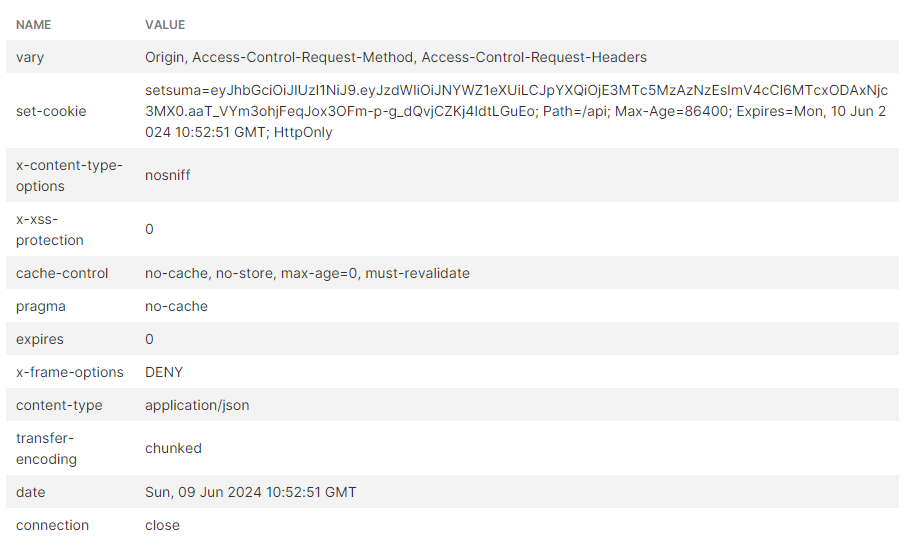
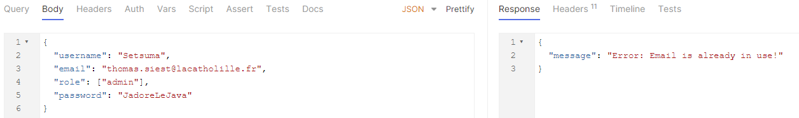

# Programmation par composants
## component-prog-setsuma
### Fait par : MASTER 1 CYBER - Thomas '*Setsuma*' Siest

## Table des matières
1. [Introduction](#introduction)
2. [Diagramme de classe](#diagramme-de-classe)
3. [Connexion à la base de données](#connexion-à-la-base-de-données)
4. [Architecture](#architecture)
5. [Consignes](#consignes)
6. [Liste des endpoints](#liste-des-endpoints)

    6.1 [ContratController](#contratcontroller)
    
    6.2 [DepartementController](#departementcontroller)
    
    6.3 [DetailEquipeController](#detailequipecontroller)
    
    6.4 [EquipeController](#equipecontroller)
    
    6.5 [EtudiantController](#etudiantcontroller)
    
    6.6 [UniversiteController](#universitecontroller)
    
    6.7 [AuthController](#authcontroller)
7. [Service Schedulé](#service-schedulé)
8. [Spring Security](#spring-security)
9. [Sécurisation des endpoints](#sécurisation-des-endpoints)
10. [Remarques](#remarques)

## Introduction
Ce projet est un projet de programmation par composants. 
Il a pour but de mettre en place une architecture de programmation par composants en utilisant le langage de programmation Java.

## Diagramme de classe
Le diagramme de classe est disponible dans le [fichier](src/main/resources/MCD-MLD.png).

## Connexion à la base de données
Pour se connecter à la base de données, il faut modifier le fichier `application.properties`
et mettre les informations de connexion à la base de données.

## Architecture
L'architecture du projet est la suivante :
- `src/main/java` : Contient les fichiers sources du projet
  - `com.setsuma.component_prog_setsuma` : Contient les fichiers sources du projet
    - `controller` : Contient les [fichiers sources des contrôleurs](src/main/java/com/example/component_prog_setsuma/Controller)
    - `entity` : Contient les [fichiers sources des entités](src/main/java/com/example/component_prog_setsuma/Entity)
    - `repository` : Contient [les fichiers sources des repositories](src/main/java/com/example/component_prog_setsuma/Repository)
    - `service` : Contient [les fichiers sources des services](src/main/java/com/example/component_prog_setsuma/Service)
    - `ComponentProgSetsumaApplication.java` : Classe principale du projet
- `src/main/resources` : Contient les [ressources du projet](src/main/resources)

## Consignes
### 1e occurrence pour le DIMANCHE 26 mai 15H00
Pour plus d'informations, veuillez consulter le fichier `CompteRendu.pdf`.
Disponible dans le [fichier](src/main/resources/CompteRendu.pdf).
### 2e occurrence pour le DIMANCHE 9 juin 15H00
Pour plus d'informations, veuillez consulter le fichier `CompteRendu2.pdf`.
Disponible dans le [fichier](src/main/resources/CompteRendu2.pdf).

## Liste des endpoints
### ContratController

| Endpoint                                          | Method | Description                               | Headers                        | Body    | Params                |
|---------------------------------------------------|--------|-------------------------------------------|--------------------------------|---------|-----------------------|
| /setsuma/contrats/assign-contrat                  | POST   | Assigner un contrat à un étudiant         | Content-Type: application/json | N/A     | idContrat, idEtudiant |
| /setsuma/contrats/etudiants/{idEtudiant}/contrats | GET    | Obtenir les contrats par ID de l'étudiant | Content-Type: application/json | N/A     | idEtudiant            |
| /setsuma/contrats/add-contrat                     | POST   | Ajouter un nouveau contrat                | Content-Type: application/json | Contrat | N/A                   |
| /setsuma/contrats/modify-contrat                  | PATCH  | Modifier un contrat existant              | Content-Type: application/json | Contrat | N/A                   |
| /setsuma/contrats/delete-contrat                  | DELETE | Supprimer un contrat                      | Content-Type: application/json | N/A     | idContrat             |
| /setsuma/contrats/contrat                         | GET    | Trouver un contrat par ID                 | Content-Type: application/json | N/A     | idContrat             |
| /setsuma/contrats/contrats                        | GET    | Lister tous les contrats                  | Content-Type: application/json | N/A     | N/A                   |

### DepartementController

| Endpoint                                 | Method | Description                      | Headers                        | Body        | Params        |
|------------------------------------------|--------|----------------------------------|--------------------------------|-------------|---------------|
| /setsuma/departements/add-departement    | POST   | Ajouter un nouveau département   | Content-Type: application/json | Departement | N/A           |
| /setsuma/departements/modify-departement | PATCH  | Modifier un département existant | Content-Type: application/json | Departement | N/A           |
| /setsuma/departements/delete-departement | DELETE | Supprimer un département         | Content-Type: application/json | N/A         | idDepartement |
| /setsuma/departements/departement        | GET    | Trouver un département par ID    | Content-Type: application/json | N/A         | idDepartement |
| /setsuma/departements/departements       | GET    | Lister tous les départements     | Content-Type: application/json | N/A         | N/A           |

### DetailEquipeController

| Endpoint                                     | Method | Description                          | Headers                        | Body         | Params         |
|----------------------------------------------|--------|--------------------------------------|--------------------------------|--------------|----------------|
| /setsuma/detail-equipes/add-detail-equipe    | POST   | Ajouter un nouveau détail d'équipe   | Content-Type: application/json | DetailEquipe | N/A            |
| /setsuma/detail-equipes/modify-detail-equipe | PATCH  | Modifier un détail d'équipe existant | Content-Type: application/json | DetailEquipe | N/A            |
| /setsuma/detail-equipes/delete-detail-equipe | DELETE | Supprimer un détail d'équipe         | Content-Type: application/json | N/A          | idDetailEquipe |
| /setsuma/detail-equipes/detail-equipe        | GET    | Trouver un détail d'équipe par ID    | Content-Type: application/json | N/A          | idDetailEquipe |
| /setsuma/detail-equipes/detail-equipes       | GET    | Lister tous les détails d'équipe     | Content-Type: application/json | N/A          | N/A            |

### EquipeController

| Endpoint                       | Method | Description                   | Headers                        | Body   | Params   |
|--------------------------------|--------|-------------------------------|--------------------------------|--------|----------|
| /setsuma/equipes/add-equipe    | POST   | Ajouter une nouvelle équipe   | Content-Type: application/json | Equipe | N/A      |
| /setsuma/equipes/modify-equipe | PATCH  | Modifier une équipe existante | Content-Type: application/json | Equipe | N/A      |
| /setsuma/equipes/delete-equipe | DELETE | Supprimer une équipe          | Content-Type: application/json | N/A    | idEquipe |
| /setsuma/equipes/equipe        | GET    | Trouver une équipe par ID     | Content-Type: application/json | N/A    | idEquipe |
| /setsuma/equipes/equipes       | GET    | Lister toutes les équipes     | Content-Type: application/json | N/A    | N/A      |

### EtudiantController

| Endpoint                                | Method | Description                              | Headers                        | Body     | Params     |
|-----------------------------------------|--------|------------------------------------------|--------------------------------|----------|------------|
| /setsuma/etudiants/{idEtudiant}/equipes | GET    | Obtenir les équipes par ID de l'étudiant | Content-Type: application/json | N/A      | idEtudiant |
| /setsuma/etudiants/add-etudiant         | POST   | Ajouter un nouvel étudiant               | Content-Type: application/json | Etudiant | N/A        |
| /setsuma/etudiants/modify-etudiant      | PATCH  | Modifier un étudiant existant            | Content-Type: application/json | Etudiant | N/A        |
| /setsuma/etudiants/delete-etudiant      | DELETE | Supprimer un étudiant                    | Content-Type: application/json | N/A      | idEtudiant |
| /setsuma/etudiants/etudiant             | GET    | Trouver un étudiant par ID               | Content-Type: application/json | N/A      | idEtudiant |
| /setsuma/etudiants/etudiants            | GET    | Lister tous les étudiants                | Content-Type: application/json | N/A      | N/A        |

### UniversiteController

| Endpoint                                   | Method | Description                                     | Headers                        | Body       | Params           |
|--------------------------------------------|--------|-------------------------------------------------|--------------------------------|------------|------------------|
| /setsuma/universites/{idUniv}/departements | GET    | Obtenir les départements par ID de l'université | Content-Type: application/json | N/A        | idUniv           |
| /setsuma/universites/assign-departement    | POST   | Assigner un département à une université        | Content-Type: application/json | N/A        | idUniv, idDepart |
| /setsuma/universites/add-universite        | POST   | Ajouter une nouvelle université                 | Content-Type: application/json | Universite | N/A              |
| /setsuma/universites/modify-universite     | PATCH  | Modifier une université existante               | Content-Type: application/json | Universite | N/A              |
| /setsuma/universites/delete-universite     | DELETE | Supprimer une université                        | Content-Type: application/json | N/A        | idUniversite     |
| /setsuma/universites/universite            | GET    | Trouver une université par ID                   | Content-Type: application/json | N/A        | idUniversite     |
| /setsuma/universites/universites           | GET    | Lister toutes les universités                   | Content-Type: application/json | N/A        | N/A              |

### AuthController

| Endpoint          | Method | Description                       | Headers                        | Body          | Params |
|-------------------|--------|-----------------------------------|--------------------------------|---------------|--------|
| /api/auth/signin  | POST   | Authentifier un utilisateur       | Content-Type: application/json | LoginRequest  | N/A    |
| /api/auth/signup  | POST   | Enregistrer un nouvel utilisateur | Content-Type: application/json | SignupRequest | N/A    |
| /api/auth/signout | POST   | Déconnecter un utilisateur        | Content-Type: application/json | N/A           | N/A    |

## Service Schedulé
Mise en place d'un service schedulé pour archiver les contrats expirés.
La mise à jour des contrats expirés se fait tous les jours à 13h.
Dans ce [fichier](src/main/java/com/example/component_prog_setsuma/Component/ContratScheduler.java)
Voici une preuve ci-dessous :

---
## Spring Security
Mise en place de 3 endpoints pour l'authentification :
1. `/api/auth/signin` : Authentifier un utilisateur
2. `/api/auth/signup` : Enregistrer un nouvel utilisateur
3. `/api/auth/signout` : Déconnecter un utilisateur

Voici les différents screenshots pour l'authentification :
1. Authentifier un utilisateur
   * Utilisateur non authentifié
     
   * Utilisateur authentifié

   * Création du token

2. Enregistrer un utilisateur
   * Mail déjà utilisé

   * Username déjà utilisé

   * Utilisateur authentifié

3. Déconnecter un utilisateur
   * Utilisateur déconnecté
     

## Sécurisation des endpoints
La sécurisation des endpoints se fait par l'intermédiaire de Spring Security.
Via ce [fichier](src/main/java/com/example/component_prog_setsuma/Security/WebSecurityConfig.java)
Voici une preuve ci-dessous avec le endpoint `/setsuma/etudiants/add-etudiant` :
   * Utilisateur non autorisé
     
   * Utilisateur autorisé
     

## Remarques
1. J'ai décidé de faire une nomenclature selon d'abord le nom de la classe, 
puis le type de classe :
   * Controller
   * Repo (Repository)
   * Service

2. On utilisera @Data car il regroupe les annotations 
@ToString, @EqualsAndHashCode, @Getter / @Setter et @RequiredArgsConstructor.
Cela permet de réduire le code et de le rendre plus lisible.

3. Pas besoin de mettre les paramètres FetchType.LAZY car ils y sont par défaut pour les relations ManyToOne et OneToMany.
Alors que pour les relations OneToOne et ManyToOne, c'est FetchType.EAGER qui est par défaut.

4. Lister tous les contrats d’une équipe X n'étant pas possible, car il n'y a pas de relation entre les contrats et les équipes.
Je suis parti sur "lister tous les contrats d'un étudiant X".

5. Affecter un contrat à un étudiant a été fait dans le ContratRepo
car c'est ici que l'on peut ajouter un contrat à un étudiant 
grâce à la clé étrangère `etudiant_id_etudiant`.