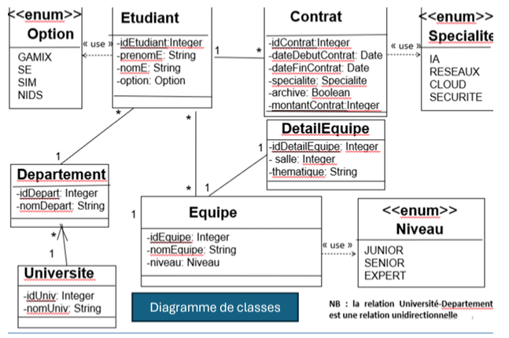

# Programmation par composants
## component-prog-setsuma
### Fait par : MASTER 1 CYBER - Thomas '*Setsuma*' Siest

## Table des matières
1. [Introduction](#introduction)
2. [Diagramme de classe](#diagramme-de-classe)
3. [Architecture](#architecture)
4. [Consignes](#consignes)
5. [Remarques](#remarques)

## Introduction
Ce projet est un projet de programmation par composants. 
Il a pour but de mettre en place une architecture de programmation par composants en utilisant le langage de programmation Java.

## Diagramme de classe
Le diagramme de classe est disponible dans le [fichier](src/main/resources/MCD-MLD.png).

## Architecture
L'architecture du projet est la suivante :
- `src/main/java` : Contient les fichiers sources du projet
  - `com.setsuma.componentprog` : Contient les fichiers sources du projet
    - `controller` : Contient les fichiers sources des contrôleurs
    - `entity` : Contient les fichiers sources des entités
    - `repository` : Contient les fichiers sources des repositories
    - `service` : Contient les fichiers sources des services
    - `ComponentProgSetsumaApplication.java` : Classe principale du projet
- `src/main/resources` : Contient les ressources du projet

## Consignes
##  A rendre pour le DIMANCHE 26 mai 15H00

Pour plus d'informations, veuillez consulter le fichier `CompteRendu.pdf`.
Disponible dans le [fichier](src/main/resources/CompteRendu.pdf).

## Remarques
1. J'ai décidé de faire une nomenclature selon d'abord le nom de la classe, 
puis le type de classe :
   * Controller
   * Repo (Repository)
   * Service

2. On utilisera @Data car il regroupe les annotations 
@ToString, @EqualsAndHashCode, @Getter / @Setter et @RequiredArgsConstructor.
Cela permet de reduire le code et de le rendre plus lisible.

3. Pas besoin de mettre les parametres FetchType.LAZY car ils y sont par defaut pour les relations ManyToOne et OneToMany.
Alors que pour les relations OneToOne et ManyToOne, c'est FetchType.EAGER qui est par défaut.

4. Lister tous les contrats d’une équipe X n'étant pas possible car il n'y a pas de relation entre les contrats et les équipes.
Je suis parti sur "lister tous les contrats d'un étudiant X".

5. Affecter un contrat à un étudiant a été fait dans le ContratRepo
car c'est ici que l'on peut ajouter un contrat à un étudiant 
grâce à la clé étrangère `etudiant_id_etudiant`.